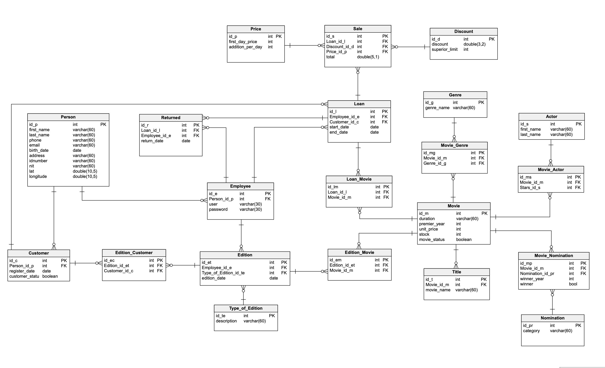

# Retro Club
Video Club webhosted app.
Software Engineering lecture task.

## Database
We are using MYSQL v8.
The SQL ORM for this project:

Database have been designed using Vertabelo.
website: https://www.vertabelo.com

## FrontEnd
EJS template engine is being used in client side.
website: https://ejs.co/

## BackEnd
Express JS is being used as Node Js framework in server side.
website: https://expressjs.com/

<footer>

RV & MC 2020. UCB - Bolivia.

</footer>